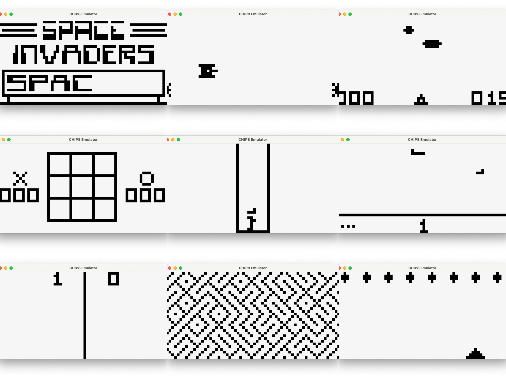
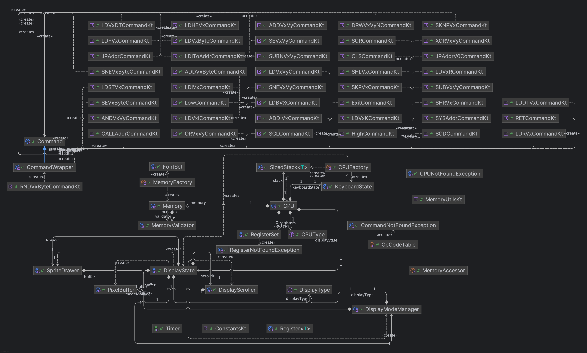

<p align="center">
    
</p>
<p align="center"><h1 align="center">CHIP8-KT</h1>
<p align="center">
	<em><code>❯ Bringing CHIP-8 classics back to life — now in Kotlin</code></em>
</p>
<p align="center">
	
	
	
	
</p>
<p align="center"><!-- default option, no dependency badges. -->
</p>
<p align="center">
	<!-- default option, no dependency badges. -->
</p>
<br>

## 📚 Table of Contents

- [🔍 Overview](#-overview)
- [✨ Features](#-features)
- [🏗️ Project Structure](#-project-structure)
  - [🗂️ Project Index](#-project-index)
- [🚀 Getting Started](#-getting-started)
  - [🧰 Prerequisites](#-prerequisites)
  - [💾 Installation](#-installation)
  - [🕹️ Usage](#-usage)
  - [✅ Testing](#-testing)
- [🛣️ Project Roadmap](#-project-roadmap)
- [🤝 Contributing](#-contributing)
- [📚 Reference](#-reference)

---

##  🔍 Overview


This implementation of the Chip-8 was a first step on my learning of emulation.

The main goal of this investigation process is to achieve a complete Game Boy Color emulator as it was one that gave me 
lots of happy times throughout my childhood. This is my way to push myself to further extents as a Recognition to all of
those who came up with those emulators at the time

The main ideas behind the project were:
- Learn how a System can be modeled into an emulator
- Ignore the memory aspects with a high level language first to learn step-by-step about emulation itself
- Create an emulator that can work as a reference for others by creating an object-oriented solution
- Practice modularization of the project by using maven submodules
- Create the same emulator in a low level language (either c or rust) to make emphasis on memory management
- Create a Game Boy Color emulator in the low level language selected
- Make a project till the end :)

---

##  ✨ Features

<code>❯</code> **Complete CHIP-8 Interpreter:** Faithfully executes classic CHIP-8 ROMs.

<code>❯</code> **Written in Kotlin:** Modern, concise, and expressive codebase.

<code>❯</code> **Object-Oriented Design:** Modular and extensible architecture, easy to understand and maintain.

<code>❯</code> **Keyboard Input Handling:** Maps CHIP-8 keys to your physical keyboard for interactive gameplay.

<code>❯</code> **Sound Support:** Beep emulation for authentic CHIP-8 audio feedback.

<code>❯</code> **Test ROM Suite:** Includes a comprehensive set of test ROMs to verify emulator correctness and compatibility.

<code>❯</code> **Maven Multi-Module Project:** Clean separation of concerns between core, UI, controller, and system logic.

<code>❯</code> **Easy to Run & Extend:** Simple entry point and clear structure for adding new features or learning about emulation.

<code>❯</code> **Open Source:** MIT-licensed and open for contributions!

---

##  🏗️ Project Structure



This Chip-8 project is divided into 4 Maven submodules.

```
└── Chip8-Kt/
    ├── chip8-app   - This submodule only contains the Main file
    ├── controller  - A mother board of sorts. Controls tickers and timers
    ├── ui          - JavaFx UI implementation; Handles keyboard 
    ├── roms        - Rom selection
    ├── system      - CPU implementation. Logic layer
    └── pom.xml
```

To begin fiddling with the emulator I would suggest the `system` module.

The CPU class holds the state of the memory, registers, display, keyboard, etc.
The only method exposed by the cpu is the `runCycle()` where the cpu will `fetch()`, `decode()` and `execute(command)`

The Commands are implemented from an interface which only method is the `execute()`

Also, the system supports both the Chip-8 and Super-Chip-8 systems

### 🗂️ Project Index
<details open>
	<summary><b><code>CHIP8-KT/</code></b></summary>
	<details> <!-- chip8-app Submodule -->
		<summary><b>chip8-app</b></summary>
		<blockquote>
			<details>
				<summary><b>src</b></summary>
				<blockquote>
					<details>
						<summary><b>main</b></summary>
						<blockquote>
							<details>
								<summary><b>kotlin</b></summary>
								<blockquote>
									<table>
									<tr>
										<td><b><a href='https://github.com/tomassirio/Chip8-Kt/blob/master/chip8-app/src/main/kotlin/Main.kt'>Main.kt</a></b></td>
										<td><code>❯ Main File. The program runs from here</code></td>
									</tr>
									</table>
								</blockquote>
							</details>
						</blockquote>
					</details>
				</blockquote>
			</details>
		</blockquote>
	</details>
	<details> <!-- system Submodule -->
		<summary><b>system</b></summary>
		<blockquote>
			<details>
				<summary><b>src</b></summary>
				<blockquote>
					<details>
						<summary><b>main</b></summary>
						<blockquote>
							<details>
								<summary><b>kotlin</b></summary>
								<blockquote>
									<details>
										<summary><b>com</b></summary>
										<blockquote>
											<details>
												<summary><b>tomassirio</b></summary>
												<blockquote>
													<details>
														<summary><b>emulation</b></summary>
														<blockquote>
															<details>
																<summary><b>chip8</b></summary>
																<blockquote>
																	<details>
																		<summary><b>system</b></summary>
																		<blockquote>
																			<details>
																				<summary><b>memory</b></summary>
																				<blockquote>
																					<table>
																					<tr>
																						<td><b><a href='https://github.com/tomassirio/Chip8-Kt/blob/master/system/src/main/kotlin/com/tomassirio/emulation/chip8/system/memory/Memory.kt'>Memory.kt</a></b></td>
																						<td><code>❯ Chip8's Cpu Memory. 2048 bytes</code></td>
																					</tr>
																					</table>
																					<details>
																						<summary><b>preload</b></summary>
																						<blockquote>
																							<table>
																							<tr>
																								<td><b><a href='https://github.com/tomassirio/Chip8-Kt/blob/master/system/src/main/kotlin/com/tomassirio/emulation/chip8/system/memory/preload/FontSet.kt'>FontSet.kt</a></b></td>
																								<td><code>❯ Fontset. Preloaded in the first 512 bytes</code></td>
																							</tr>
																							</table>
																						</blockquote>
																					</details>
																					<details>
																						<summary><b>factory</b></summary>
																						<blockquote>
																							<table>
																							<tr>
																								<td><b><a href='https://github.com/tomassirio/Chip8-Kt/blob/master/system/src/main/kotlin/com/tomassirio/emulation/chip8/system/memory/factory/MemoryFactory.kt'>MemoryFactory.kt</a></b></td>
																								<td><code>❯ Factory to create Memory instances</code></td>
																							</tr>
																							</table>
																						</blockquote>
																					</details>
																					<details>
																						<summary><b>validator</b></summary>
																						<blockquote>
																							<table>
																							<tr>
																								<td><b><a href='https://github.com/tomassirio/Chip8-Kt/blob/master/system/src/main/kotlin/com/tomassirio/emulation/chip8/system/memory/validator/MemoryValidator.kt'>MemoryValidator.kt</a></b></td>
																								<td><code>❯ Validates memory locking and overflows</code></td>
																							</tr>
																							</table>
																						</blockquote>
																					</details>
																					<details>
																						<summary><b>accessor</b></summary>
																						<blockquote>
																							<table>
																							<tr>
																								<td><b><a href='https://github.com/tomassirio/Chip8-Kt/blob/master/system/src/main/kotlin/com/tomassirio/emulation/chip8/system/memory/accessor/MemoryAccessor.kt'>MemoryAccessor.kt</a></b></td>
																								<td><code>❯ Utility class to access Memory; Delegates responsibilities</code></td>
																							</tr>
																							</table>
																						</blockquote>
																					</details>
																					<details>
																						<summary><b>util</b></summary>
																						<blockquote>
																							<table>
																							<tr>
																								<td><b><a href='https://github.com/tomassirio/Chip8-Kt/blob/master/system/src/main/kotlin/com/tomassirio/emulation/chip8/system/memory/util/MemoryUtils.kt'>MemoryUtils.kt</a></b></td>
																								<td><code>❯ Memory utility; Could be moved to Accessor</code></td>
																							</tr>
																							</table>
																						</blockquote>
																					</details>
																				</blockquote>
																			</details>
																			<details>
																				<summary><b>constants</b></summary>
																				<blockquote>
																					<table>
																					<tr>
																						<td><b><a href='https://github.com/tomassirio/Chip8-Kt/blob/master/system/src/main/kotlin/com/tomassirio/emulation/chip8/system/constants/Constants.kt'>Constants.kt</a></b></td>
																						<td><code>❯ System Constants</code></td>
																					</tr>
																					</table>
																				</blockquote>
																			</details>
																			<details>
																				<summary><b>io</b></summary>
																				<blockquote>
																					<details>
																						<summary><b>display</b></summary>
																						<blockquote>
																							<table>
																							<tr>
																								<td><b><a href='https://github.com/tomassirio/Chip8-Kt/blob/master/system/src/main/kotlin/com/tomassirio/emulation/chip8/system/io/display/DisplayScroller.kt'>DisplayScroller.kt</a></b></td>
																								<td><code>❯ Takes responsibility for Scrolling; Super-Chip-8 feature</code></td>
																							</tr>
																							<tr>
																								<td><b><a href='https://github.com/tomassirio/Chip8-Kt/blob/master/system/src/main/kotlin/com/tomassirio/emulation/chip8/system/io/display/PixelBuffer.kt'>PixelBuffer.kt</a></b></td>
																								<td><code>❯ Manages Pixels</code></td>
																							</tr>
																							<tr>
																								<td><b><a href='https://github.com/tomassirio/Chip8-Kt/blob/master/system/src/main/kotlin/com/tomassirio/emulation/chip8/system/io/display/DisplayState.kt'>DisplayState.kt</a></b></td>
																								<td><code>❯ Facade for Display</code></td>
																							</tr>
																							<tr>
																								<td><b><a href='https://github.com/tomassirio/Chip8-Kt/blob/master/system/src/main/kotlin/com/tomassirio/emulation/chip8/system/io/display/DisplayType.kt'>DisplayType.kt</a></b></td>
																								<td><code>❯ NORMAL/EXTENDED modes</code></td>
																							</tr>
																							<tr>
																								<td><b><a href='https://github.com/tomassirio/Chip8-Kt/blob/master/system/src/main/kotlin/com/tomassirio/emulation/chip8/system/io/display/DisplayModeManager.kt'>DisplayModeManager.kt</a></b></td>
																								<td><code>❯ Manages Display Modes</code></td>
																							</tr>
																							<tr>
																								<td><b><a href='https://github.com/tomassirio/Chip8-Kt/blob/master/system/src/main/kotlin/com/tomassirio/emulation/chip8/system/io/display/SpriteDrawer.kt'>SpriteDrawer.kt</a></b></td>
																								<td><code>❯ Draws Sprites</code></td>
																							</tr>
																							</table>
																						</blockquote>
																					</details>
																					<details>
																						<summary><b>keyboard</b></summary>
																						<blockquote>
																							<table>
																							<tr>
																								<td><b><a href='https://github.com/tomassirio/Chip8-Kt/blob/master/system/src/main/kotlin/com/tomassirio/emulation/chip8/system/io/keyboard/KeyboardState.kt'>KeyboardState.kt</a></b></td>
																								<td><code>❯ Holds state for keyboard</code></td>
																							</tr>
																							</table>
																						</blockquote>
																					</details>
																				</blockquote>
																			</details>
																			<details>
																				<summary><b>cpu</b></summary>
																				<blockquote>
																					<table>
																					<tr>
																						<td><b><a href='https://github.com/tomassirio/Chip8-Kt/blob/master/system/src/main/kotlin/com/tomassirio/emulation/chip8/system/cpu/CPUType.kt'>CPUType.kt</a></b></td>
																						<td><code>❯ [CHIP-8/SUPER-CHIP-8]</code></td>
																					</tr>
																					<tr>
																						<td><b><a href='https://github.com/tomassirio/Chip8-Kt/blob/master/system/src/main/kotlin/com/tomassirio/emulation/chip8/system/cpu/CPU.kt'>CPU.kt</a></b></td>
																						<td><code>❯ Main Class of the System. Fetches/Decodes/Executes code</code></td>
																					</tr>
																					</table>
																					<details>
																						<summary><b>opcode</b></summary>
																						<blockquote>
																							<table>
																							<tr>
																								<td><b><a href='https://github.com/tomassirio/Chip8-Kt/blob/master/system/src/main/kotlin/com/tomassirio/emulation/chip8/system/cpu/opcode/Command.kt'>Command.kt</a></b></td>
																								<td><code>❯ Command Interface. Executes commands</code></td>
																							</tr>
																							<tr>
																								<td><b><a href='https://github.com/tomassirio/Chip8-Kt/blob/master/system/src/main/kotlin/com/tomassirio/emulation/chip8/system/cpu/opcode/OpCodeTable.kt'>OpCodeTable.kt</a></b></td>
																								<td><code>❯ Holds mapping for all OpCodes</code></td>
																							</tr>
																							</table>
																							<details>
																								<summary><b>commands</b></summary>
																								<blockquote>
																									<table>
																									<tr>
																										<td><b><a href='https://github.com/tomassirio/Chip8-Kt/blob/master/system/src/main/kotlin/com/tomassirio/emulation/chip8/system/cpu/opcode/commands/ExitCommand.kt'>ExitCommand.kt</a></b></td>
																									</tr>
																									<tr>
																										<td><b><a href='https://github.com/tomassirio/Chip8-Kt/blob/master/system/src/main/kotlin/com/tomassirio/emulation/chip8/system/cpu/opcode/commands/SUBNVxVyCommand.kt'>SUBNVxVyCommand.kt</a></b></td>
																									</tr>
																									<tr>
																										<td><b><a href='https://github.com/tomassirio/Chip8-Kt/blob/master/system/src/main/kotlin/com/tomassirio/emulation/chip8/system/cpu/opcode/commands/LDHFVxCommand.kt'>LDHFVxCommand.kt</a></b></td>
																									</tr>
																									<tr>
																										<td><b><a href='https://github.com/tomassirio/Chip8-Kt/blob/master/system/src/main/kotlin/com/tomassirio/emulation/chip8/system/cpu/opcode/commands/LDDTVxCommand.kt'>LDDTVxCommand.kt</a></b></td>
																									</tr>
																									<tr>
																										<td><b><a href='https://github.com/tomassirio/Chip8-Kt/blob/master/system/src/main/kotlin/com/tomassirio/emulation/chip8/system/cpu/opcode/commands/SNEVxByteCommand.kt'>SNEVxByteCommand.kt</a></b></td>
																									</tr>
																									<tr>
																										<td><b><a href='https://github.com/tomassirio/Chip8-Kt/blob/master/system/src/main/kotlin/com/tomassirio/emulation/chip8/system/cpu/opcode/commands/RETCommand.kt'>RETCommand.kt</a></b></td>
																									</tr>
																									<tr>
																										<td><b><a href='https://github.com/tomassirio/Chip8-Kt/blob/master/system/src/main/kotlin/com/tomassirio/emulation/chip8/system/cpu/opcode/commands/LDIVxCommand.kt'>LDIVxCommand.kt</a></b></td>
																									</tr>
																									<tr>
																										<td><b><a href='https://github.com/tomassirio/Chip8-Kt/blob/master/system/src/main/kotlin/com/tomassirio/emulation/chip8/system/cpu/opcode/commands/SEVxVyCommand.kt'>SEVxVyCommand.kt</a></b></td>
																									</tr>
																									<tr>
																										<td><b><a href='https://github.com/tomassirio/Chip8-Kt/blob/master/system/src/main/kotlin/com/tomassirio/emulation/chip8/system/cpu/opcode/commands/XORVxVyCommand.kt'>XORVxVyCommand.kt</a></b></td>
																									</tr>
																									<tr>
																										<td><b><a href='https://github.com/tomassirio/Chip8-Kt/blob/master/system/src/main/kotlin/com/tomassirio/emulation/chip8/system/cpu/opcode/commands/SCRCommand.kt'>SCRCommand.kt</a></b></td>
																									</tr>
																									<tr>
																										<td><b><a href='https://github.com/tomassirio/Chip8-Kt/blob/master/system/src/main/kotlin/com/tomassirio/emulation/chip8/system/cpu/opcode/commands/SEVxByteCommand.kt'>SEVxByteCommand.kt</a></b></td>
																									</tr>
																									<tr>
																										<td><b><a href='https://github.com/tomassirio/Chip8-Kt/blob/master/system/src/main/kotlin/com/tomassirio/emulation/chip8/system/cpu/opcode/commands/SHRVxCommand.kt'>SHRVxCommand.kt</a></b></td>
																									</tr>
																									<tr>
																										<td><b><a href='https://github.com/tomassirio/Chip8-Kt/blob/master/system/src/main/kotlin/com/tomassirio/emulation/chip8/system/cpu/opcode/commands/JPAddrCommand.kt'>JPAddrCommand.kt</a></b></td>
																									</tr>
																									<tr>
																										<td><b><a href='https://github.com/tomassirio/Chip8-Kt/blob/master/system/src/main/kotlin/com/tomassirio/emulation/chip8/system/cpu/opcode/commands/ANDVxVyCommand.kt'>ANDVxVyCommand.kt</a></b></td>
																									</tr>
																									<tr>
																										<td><b><a href='https://github.com/tomassirio/Chip8-Kt/blob/master/system/src/main/kotlin/com/tomassirio/emulation/chip8/system/cpu/opcode/commands/HighCommand.kt'>HighCommand.kt</a></b></td>
																									</tr>
																									<tr>
																										<td><b><a href='https://github.com/tomassirio/Chip8-Kt/blob/master/system/src/main/kotlin/com/tomassirio/emulation/chip8/system/cpu/opcode/commands/CALLAddrCommand.kt'>CALLAddrCommand.kt</a></b></td>
																									</tr>
																									<tr>
																										<td><b><a href='https://github.com/tomassirio/Chip8-Kt/blob/master/system/src/main/kotlin/com/tomassirio/emulation/chip8/system/cpu/opcode/commands/SCDCommand.kt'>SCDCommand.kt</a></b></td>
																									</tr>
																									<tr>
																										<td><b><a href='https://github.com/tomassirio/Chip8-Kt/blob/master/system/src/main/kotlin/com/tomassirio/emulation/chip8/system/cpu/opcode/commands/ORVxVyCommand.kt'>ORVxVyCommand.kt</a></b></td>
																									</tr>
																									<tr>
																										<td><b><a href='https://github.com/tomassirio/Chip8-Kt/blob/master/system/src/main/kotlin/com/tomassirio/emulation/chip8/system/cpu/opcode/commands/LowCommand.kt'>LowCommand.kt</a></b></td>
																									</tr>
																									<tr>
																										<td><b><a href='https://github.com/tomassirio/Chip8-Kt/blob/master/system/src/main/kotlin/com/tomassirio/emulation/chip8/system/cpu/opcode/commands/CLSCommand.kt'>CLSCommand.kt</a></b></td>
																									</tr>
																									<tr>
																										<td><b><a href='https://github.com/tomassirio/Chip8-Kt/blob/master/system/src/main/kotlin/com/tomassirio/emulation/chip8/system/cpu/opcode/commands/SHLVxCommand.kt'>SHLVxCommand.kt</a></b></td>
																									</tr>
																									<tr>
																										<td><b><a href='https://github.com/tomassirio/Chip8-Kt/blob/master/system/src/main/kotlin/com/tomassirio/emulation/chip8/system/cpu/opcode/commands/ADDVxVyCommand.kt'>ADDVxVyCommand.kt</a></b></td>
																									</tr>
																									<tr>
																										<td><b><a href='https://github.com/tomassirio/Chip8-Kt/blob/master/system/src/main/kotlin/com/tomassirio/emulation/chip8/system/cpu/opcode/commands/ADDIVxCommand.kt'>ADDIVxCommand.kt</a></b></td>
																									</tr>
																									<tr>
																										<td><b><a href='https://github.com/tomassirio/Chip8-Kt/blob/master/system/src/main/kotlin/com/tomassirio/emulation/chip8/system/cpu/opcode/commands/LDVxDTCommand.kt'>LDVxDTCommand.kt</a></b></td>
																									</tr>
																									<tr>
																										<td><b><a href='https://github.com/tomassirio/Chip8-Kt/blob/master/system/src/main/kotlin/com/tomassirio/emulation/chip8/system/cpu/opcode/commands/SNEVxVyCommand.kt'>SNEVxVyCommand.kt</a></b></td>
																									</tr>
																									<tr>
																										<td><b><a href='https://github.com/tomassirio/Chip8-Kt/blob/master/system/src/main/kotlin/com/tomassirio/emulation/chip8/system/cpu/opcode/commands/RNDVxByteCommand.kt'>RNDVxByteCommand.kt</a></b></td>
																									</tr>
																									<tr>
																										<td><b><a href='https://github.com/tomassirio/Chip8-Kt/blob/master/system/src/main/kotlin/com/tomassirio/emulation/chip8/system/cpu/opcode/commands/LDBVXCommand.kt'>LDBVXCommand.kt</a></b></td>
																									</tr>
																									<tr>
																										<td><b><a href='https://github.com/tomassirio/Chip8-Kt/blob/master/system/src/main/kotlin/com/tomassirio/emulation/chip8/system/cpu/opcode/commands/LDRVxCommand.kt'>LDRVxCommand.kt</a></b></td>
																									</tr>
																									<tr>
																										<td><b><a href='https://github.com/tomassirio/Chip8-Kt/blob/master/system/src/main/kotlin/com/tomassirio/emulation/chip8/system/cpu/opcode/commands/LDSTVxCommand.kt'>LDSTVxCommand.kt</a></b></td>
																									</tr>
																									<tr>
																										<td><b><a href='https://github.com/tomassirio/Chip8-Kt/blob/master/system/src/main/kotlin/com/tomassirio/emulation/chip8/system/cpu/opcode/commands/SYSAddrCommand.kt'>SYSAddrCommand.kt</a></b></td>
																									</tr>
																									<tr>
																										<td><b><a href='https://github.com/tomassirio/Chip8-Kt/blob/master/system/src/main/kotlin/com/tomassirio/emulation/chip8/system/cpu/opcode/commands/SUBVxVyCommand.kt'>SUBVxVyCommand.kt</a></b></td>
																									</tr>
																									<tr>
																										<td><b><a href='https://github.com/tomassirio/Chip8-Kt/blob/master/system/src/main/kotlin/com/tomassirio/emulation/chip8/system/cpu/opcode/commands/DRWVxVyNCommand.kt'>DRWVxVyNCommand.kt</a></b></td>
																									</tr>
																									<tr>
																										<td><b><a href='https://github.com/tomassirio/Chip8-Kt/blob/master/system/src/main/kotlin/com/tomassirio/emulation/chip8/system/cpu/opcode/commands/LDVxICommand.kt'>LDVxICommand.kt</a></b></td>
																									</tr>
																									<tr>
																										<td><b><a href='https://github.com/tomassirio/Chip8-Kt/blob/master/system/src/main/kotlin/com/tomassirio/emulation/chip8/system/cpu/opcode/commands/LDVxVyCommand.kt'>LDVxVyCommand.kt</a></b></td>
																									</tr>
																									<tr>
																										<td><b><a href='https://github.com/tomassirio/Chip8-Kt/blob/master/system/src/main/kotlin/com/tomassirio/emulation/chip8/system/cpu/opcode/commands/SKPVxCommand.kt'>SKPVxCommand.kt</a></b></td>
																									</tr>
																									<tr>
																										<td><b><a href='https://github.com/tomassirio/Chip8-Kt/blob/master/system/src/main/kotlin/com/tomassirio/emulation/chip8/system/cpu/opcode/commands/LDVxRCommand.kt'>LDVxRCommand.kt</a></b></td>
																									</tr>
																									<tr>
																										<td><b><a href='https://github.com/tomassirio/Chip8-Kt/blob/master/system/src/main/kotlin/com/tomassirio/emulation/chip8/system/cpu/opcode/commands/LDIToAddrCommand.kt'>LDIToAddrCommand.kt</a></b></td>
																									</tr>
																									<tr>
																										<td><b><a href='https://github.com/tomassirio/Chip8-Kt/blob/master/system/src/main/kotlin/com/tomassirio/emulation/chip8/system/cpu/opcode/commands/LDVxByteCommand.kt'>LDVxByteCommand.kt</a></b></td>
																									</tr>
																									<tr>
																										<td><b><a href='https://github.com/tomassirio/Chip8-Kt/blob/master/system/src/main/kotlin/com/tomassirio/emulation/chip8/system/cpu/opcode/commands/LDVxKCommand.kt'>LDVxKCommand.kt</a></b></td>
																									</tr>
																									<tr>
																										<td><b><a href='https://github.com/tomassirio/Chip8-Kt/blob/master/system/src/main/kotlin/com/tomassirio/emulation/chip8/system/cpu/opcode/commands/SCLCommand.kt'>SCLCommand.kt</a></b></td>
																									</tr>
																									<tr>
																										<td><b><a href='https://github.com/tomassirio/Chip8-Kt/blob/master/system/src/main/kotlin/com/tomassirio/emulation/chip8/system/cpu/opcode/commands/ADDVxByteCommand.kt'>ADDVxByteCommand.kt</a></b></td>
																									</tr>
																									<tr>
																										<td><b><a href='https://github.com/tomassirio/Chip8-Kt/blob/master/system/src/main/kotlin/com/tomassirio/emulation/chip8/system/cpu/opcode/commands/LDFVxCommand.kt'>LDFVxCommand.kt</a></b></td>
																									</tr>
																									<tr>
																										<td><b><a href='https://github.com/tomassirio/Chip8-Kt/blob/master/system/src/main/kotlin/com/tomassirio/emulation/chip8/system/cpu/opcode/commands/JPAddrV0Command.kt'>JPAddrV0Command.kt</a></b></td>
																									</tr>
																									<tr>
																										<td><b><a href='https://github.com/tomassirio/Chip8-Kt/blob/master/system/src/main/kotlin/com/tomassirio/emulation/chip8/system/cpu/opcode/commands/SKNPVxCommand.kt'>SKNPVxCommand.kt</a></b></td>
																									</tr>
																									</table>
																								</blockquote>
																							</details>
																						</blockquote>
																					</details>
																					<details>
																						<summary><b>factory</b></summary>
																						<blockquote>
																							<table>
																							<tr>
																								<td><b><a href='https://github.com/tomassirio/Chip8-Kt/blob/master/system/src/main/kotlin/com/tomassirio/emulation/chip8/system/cpu/factory/CPUFactory.kt'>CPUFactory.kt</a></b></td>
																								<td><code>❯ Creates CPU Instances</code></td>
																							</tr>
																							</table>
																						</blockquote>
																					</details>
																					<details>
																						<summary><b>utils</b></summary>
																						<blockquote>
																							<table>
																							<tr>
																								<td><b><a href='https://github.com/tomassirio/Chip8-Kt/blob/master/system/src/main/kotlin/com/tomassirio/emulation/chip8/system/cpu/utils/SizedStack.kt'>SizedStack.kt</a></b></td>
																								<td><code>❯ Implementation of Stack with limited entries</code></td>
																							</tr>
																							</table>
																						</blockquote>
																					</details>
																					<details>
																						<summary><b>exception</b></summary>
																						<blockquote>
																							<table>
																							<tr>
																								<td><b><a href='https://github.com/tomassirio/Chip8-Kt/blob/master/system/src/main/kotlin/com/tomassirio/emulation/chip8/system/cpu/exception/CPUNotFoundException.kt'>CPUNotFoundException.kt</a></b></td>	</tr>
																							<tr>
																								<td><b><a href='https://github.com/tomassirio/Chip8-Kt/blob/master/system/src/main/kotlin/com/tomassirio/emulation/chip8/system/cpu/exception/RegisterNotFoundException.kt'>RegisterNotFoundException.kt</a></b></td>	</tr>
																							<tr>
																								<td><b><a href='https://github.com/tomassirio/Chip8-Kt/blob/master/system/src/main/kotlin/com/tomassirio/emulation/chip8/system/cpu/exception/CommandNotFoundException.kt'>CommandNotFoundException.kt</a></b></td>	</tr>
																							</table>
																						</blockquote>
																					</details>
																				</blockquote>
																			</details>
																			<details>
																				<summary><b>register</b></summary>
																				<blockquote>
																					<table>
																					<tr>
																						<td><b><a href='https://github.com/tomassirio/Chip8-Kt/blob/master/system/src/main/kotlin/com/tomassirio/emulation/chip8/system/register/Register.kt'>Register.kt</a></b></td>
																						<td><code>❯ [ByteRegister/ShortRegister/TimerRegister]</code></td>
																					</tr>
																					<tr>
																						<td><b><a href='https://github.com/tomassirio/Chip8-Kt/blob/master/system/src/main/kotlin/com/tomassirio/emulation/chip8/system/register/Timer.kt'>Timer.kt</a></b></td>
																						<td><code>❯ Timer interface with Tick method</code></td>
																					</tr>
																					</table>
																					<details>
																						<summary><b>utils</b></summary>
																						<blockquote>
																							<table>
																							<tr>
																								<td><b><a href='https://github.com/tomassirio/Chip8-Kt/blob/master/system/src/main/kotlin/com/tomassirio/emulation/chip8/system/register/utils/RegisterSet.kt'>RegisterSet.kt</a></b></td>
																								<td><code>❯ Util class</code></td>
																							</tr>
																							</table>
																						</blockquote>
																					</details>
																				</blockquote>
																			</details>
																		</blockquote>
																	</details>
																</blockquote>
															</details>
														</blockquote>
													</details>
												</blockquote>
											</details>
										</blockquote>
									</details>
								</blockquote>
							</details>
						</blockquote>
					</details>
				</blockquote>
			</details>
		</blockquote>
	</details>
	<details> <!-- controller Submodule -->
		<summary><b>controller</b></summary>
		<blockquote>
			<details>
				<summary><b>src</b></summary>
				<blockquote>
					<details>
						<summary><b>main</b></summary>
						<blockquote>
							<details>
								<summary><b>kotlin</b></summary>
								<blockquote>
									<details>
										<summary><b>com</b></summary>
										<blockquote>
											<details>
												<summary><b>tomassirio</b></summary>
												<blockquote>
													<details>
														<summary><b>emulation</b></summary>
														<blockquote>
															<details>
																<summary><b>chip8</b></summary>
																<blockquote>
																	<details>
																		<summary><b>controller</b></summary>
																		<blockquote>
																			<table>
																			<tr>
																				<td><b><a href='https://github.com/tomassirio/Chip8-Kt/blob/master/controller/src/main/kotlin/com/tomassirio/emulation/chip8/controller/SystemController.kt'>SystemController.kt</a></b></td>
																				<td><code>❯ Facades the CPU; Works as a Main Board</code></td>
																			</tr>
																			</table>
																			<details>
																				<summary><b>sfx</b></summary>
																				<blockquote>
																					<table>
																					<tr>
																						<td><b><a href='https://github.com/tomassirio/Chip8-Kt/blob/master/controller/src/main/kotlin/com/tomassirio/emulation/chip8/controller/sfx/SoundPlayer.kt'>SoundPlayer.kt</a></b></td>
																						<td><code>❯ Plays Sounds. Uses beep.wav</code></td>
																					</tr>
																					</table>
																				</blockquote>
																			</details>
																			<details>
																				<summary><b>loader</b></summary>
																				<blockquote>
																					<table>
																					<tr>
																						<td><b><a href='https://github.com/tomassirio/Chip8-Kt/blob/master/controller/src/main/kotlin/com/tomassirio/emulation/chip8/controller/loader/RomLoader.kt'>RomLoader.kt</a></b></td>
																						<td><code>❯ Loads Roms</code></td>
																					</tr>
																					</table>
																				</blockquote>
																			</details>
																			<details>
																				<summary><b>debug</b></summary>
																				<blockquote>
																					<table>
																					<tr>
																						<td><b><a href='https://github.com/tomassirio/Chip8-Kt/blob/master/controller/src/main/kotlin/com/tomassirio/emulation/chip8/controller/debug/DebugLevel.kt'>DebugLevel.kt</a></b></td>
																						<td><code>❯ [NONE/MINIMAL/FULL]</code></td>
																					</tr>
																					<tr>
																						<td><b><a href='https://github.com/tomassirio/Chip8-Kt/blob/master/controller/src/main/kotlin/com/tomassirio/emulation/chip8/controller/debug/CPUDebugger.kt'>CPUDebugger.kt</a></b></td>
																						<td><code>❯ Debugger class for CPU</code></td>
																					</tr>
																					</table>
																				</blockquote>
																			</details>
																			<details>
																				<summary><b>handler</b></summary>
																				<blockquote>
																					<table>
																					<tr>
																						<td><b><a href='https://github.com/tomassirio/Chip8-Kt/blob/master/controller/src/main/kotlin/com/tomassirio/emulation/chip8/controller/handler/KeyHandler.kt'>KeyHandler.kt</a></b></td>
																						<td><code>❯ Works on key events</code></td>
																					</tr>
																					</table>
																				</blockquote>
																			</details>
																		</blockquote>
																	</details>
																</blockquote>
															</details>
														</blockquote>
													</details>
												</blockquote>
											</details>
										</blockquote>
									</details>
								</blockquote>
							</details>
							<details>
								<summary><b>resources</b></summary>
								<blockquote>
									<table>
									<tr>
										<td><b><a href='https://github.com/tomassirio/Chip8-Kt/blob/master/controller/src/main/resources/beep.wav'>beep.wav</a></b></td>
										<td><code>❯ Sound resource</code></td>
									</tr>
									</table>
								</blockquote>
							</details>
						</blockquote>
					</details>
				</blockquote>
			</details>
		</blockquote>
	</details>
	<details> <!-- ui Submodule -->
		<summary><b>ui</b></summary>
		<blockquote>
			<details>
				<summary><b>src</b></summary>
				<blockquote>
					<details>
						<summary><b>main</b></summary>
						<blockquote>
							<details>
								<summary><b>kotlin</b></summary>
								<blockquote>
									<details>
										<summary><b>com</b></summary>
										<blockquote>
											<details>
												<summary><b>tomassirio</b></summary>
												<blockquote>
													<details>
														<summary><b>emulation</b></summary>
														<blockquote>
															<details>
																<summary><b>chip8</b></summary>
																<blockquote>
																	<details>
																		<summary><b>ui</b></summary>
																		<blockquote>
																			<table>
																			<tr>
																				<td><b><a href='https://github.com/tomassirio/Chip8-Kt/blob/master/ui/src/main/kotlin/com/tomassirio/emulation/chip8/ui/EmulatorUI.kt'>EmulatorUI.kt</a></b></td>
																				<td><code>❯ Main Emulator class</code></td>
																			</tr>
																			</table>
																			<details>
																				<summary><b>mapping</b></summary>
																				<blockquote>
																					<table>
																					<tr>
																						<td><b><a href='https://github.com/tomassirio/Chip8-Kt/blob/master/ui/src/main/kotlin/com/tomassirio/emulation/chip8/ui/mapping/KeyMapper.kt'>KeyMapper.kt</a></b></td>
																						<td><code>❯ Maps Keys to Chip8 keyboard</code></td>
																					</tr>
																					</table>
																				</blockquote>
																			</details>
																			<details>
																				<summary><b>params</b></summary>
																				<blockquote>
																					<table>
																					<tr>
																						<td><b><a href='https://github.com/tomassirio/Chip8-Kt/blob/master/ui/src/main/kotlin/com/tomassirio/emulation/chip8/ui/params/EmulatorParamsFactory.kt'>EmulatorParamsFactory.kt</a></b></td>
																						<td><code>❯ Gets parameters from Arguments</code></td>
																					</tr>
																					<tr>
																						<td><b><a href='https://github.com/tomassirio/Chip8-Kt/blob/master/ui/src/main/kotlin/com/tomassirio/emulation/chip8/ui/params/EmulatorParams.kt'>EmulatorParams.kt</a></b></td>
																						<td><code>❯ Holds Emulator Params</code></td>
																					</tr>
																					</table>
																				</blockquote>
																			</details>
																			<details>
																				<summary><b>pane</b></summary>
																				<blockquote>
																					<table>
																					<tr>
																						<td><b><a href='https://github.com/tomassirio/Chip8-Kt/blob/master/ui/src/main/kotlin/com/tomassirio/emulation/chip8/ui/pane/DebuggingPane.kt'>DebuggingPane.kt</a></b></td>
																						<td><code>❯ Dividing pane for CPU and Memory State</code></td>
																					</tr>
																					<tr>
																						<td><b><a href='https://github.com/tomassirio/Chip8-Kt/blob/master/ui/src/main/kotlin/com/tomassirio/emulation/chip8/ui/pane/CPUStatePane.kt'>CPUStatePane.kt</a></b></td>
																						<td><code>❯ CPU State Pane</code></td>
																					</tr>
																					<tr>
																						<td><b><a href='https://github.com/tomassirio/Chip8-Kt/blob/master/ui/src/main/kotlin/com/tomassirio/emulation/chip8/ui/pane/MemoryPane.kt'>MemoryPane.kt</a></b></td>
																						<td><code>❯ Memory Pane</code></td>
																					</tr>
																					</table>
																				</blockquote>
																			</details>
																			<details>
																				<summary><b>constants</b></summary>
																				<blockquote>
																					<table>
																					<tr>
																						<td><b><a href='https://github.com/tomassirio/Chip8-Kt/blob/master/ui/src/main/kotlin/com/tomassirio/emulation/chip8/ui/constants/Constants.kt'>Constants.kt</a></b></td>
																						<td><code>❯ UI Constants</code></td>
																					</tr>
																					</table>
																				</blockquote>
																			</details>
																			<details>
																				<summary><b>debug</b></summary>
																				<blockquote>
																					<table>
																					<tr>
																						<td><b><a href='https://github.com/tomassirio/Chip8-Kt/blob/master/ui/src/main/kotlin/com/tomassirio/emulation/chip8/ui/debug/Debug.kt'>Debug.kt</a></b></td>
																						<td><code>❯ Debbugger interface</code></td>
																					</tr>
																					</table>
																				</blockquote>
																			</details>
																			<details>
																				<summary><b>scene</b></summary>
																				<blockquote>
																					<table>
																					<tr>
																						<td><b><a href='https://github.com/tomassirio/Chip8-Kt/blob/master/ui/src/main/kotlin/com/tomassirio/emulation/chip8/ui/scene/MainScene.kt'>MainScene.kt</a></b></td>
																						<td><code>❯ Main Scene where action happens</code></td>
																					</tr>
																					</table>
																				</blockquote>
																			</details>
																		</blockquote>
																	</details>
																</blockquote>
															</details>
														</blockquote>
													</details>
												</blockquote>
											</details>
										</blockquote>
									</details>
								</blockquote>
							</details>
						</blockquote>
					</details>
				</blockquote>
			</details>
		</blockquote>
	</details>
</details>

---
## 🚀 Getting Started

### 🧰 Prerequisites

Before getting started with Chip8-Kt, ensure your runtime environment meets the following requirements:

- **Programming Language:** Kotlin
- **Packaging:** Maven


### 💾 Installation

Install Chip8-Kt using one of the following methods:

**Build from source:**

1. Clone the Chip8-Kt repository:
```sh
❯ git clone https://github.com/tomassirio/Chip8-Kt
```

2. Navigate to the project directory:
```sh
❯ cd Chip8-Kt
```

3. Install the project dependencies:
```sh
❯ mvn clean install
```

### 🕹 Usage
In order to run the project you will need a rom. This repository provides a selection of them in the `/roms` folder.

So after running `mvn clean install` you can just begin playing roms with 

```sh
❯ java -jar chip8-app/target/chip8-app-1.0-SNAPSHOT.jar --rom=roms/games/PONG     
```

#### 🔡 Parameters

This implementation of the **Chip-8** console includes a few options you can play around with

```
--rom     [Mandatory] declares path to rom
--cpu     [CHIP8/SCHIP8](default=CHIP8) defines which system to emulate between the Chip-8 and Super-Chip
--debug   [NONE/MINIMAL/FULL](default=NONE) debugging windows
--scale   [Int](default=10) scale for the pixels in the screen
--fps     [Int](default=15) Frames per second at which the rom will run
```

### ✅ Testing
This project allows for two different types of testing. Both Unit tests and 'Rom-tests'

For the Unit tests you can test your project with

```sh
❯ mvn test
```

or you can compile and test it with

```sh
❯ mvn clean verify 
```
The project can also be tested with the 'Rom-Tests' in the roms folder. Each of them can be ran as any other rom

```shell
❯ java -jar chip8-app/target/chip8-app-1.0-SNAPSHOT.jar --rom=roms/test-suite/1-chip8-logo.ch8     
```

  <blockquote>
      <summary><b>roms</b></summary>
      <blockquote>
        <details>
          <summary><b>test-suite</b></summary>
          <blockquote>
            <table>
              <tr>
                <td><b><a href='https://github.com/tomassirio/Chip8-Kt/blob/master/roms/test-suite/1-chip8-logo.ch8'>1-chip8-logo.ch8</a></b></td>
                <td><code>❯ Should print a Chip-8 logo</code></td>
              </tr>
              <tr>
                <td><b><a href='https://github.com/tomassirio/Chip8-Kt/blob/master/roms/test-suite/2-ibm-logo.ch8'>2-ibm-logo.ch8</a></b></td>
                <td><code>❯ Should print an IBM logo</code></td>
              </tr>
              <tr>
                <td><b><a href='https://github.com/tomassirio/Chip8-Kt/blob/master/roms/test-suite/3-corax%2B.ch8'>3-corax+.ch8</a></b></td>
                <td><code>❯ Corax+ test ROM</code></td>
              </tr>
              <tr>
                <td><b><a href='https://github.com/tomassirio/Chip8-Kt/blob/master/roms/test-suite/4-flags.ch8'>4-flags.ch8</a></b></td>
                <td><code>❯ Tests flag instructions</code></td>
              </tr>
              <tr>
                <td><b><a href='https://github.com/tomassirio/Chip8-Kt/blob/master/roms/test-suite/5-quirks.ch8'>5-quirks.ch8</a></b></td>
                <td><code>❯ Tests common CHIP-8 quirks</code></td>
              </tr>
              <tr>
                <td><b><a href='https://github.com/tomassirio/Chip8-Kt/blob/master/roms/test-suite/6-keypad.ch8'>6-keypad.ch8</a></b></td>
                <td><code>❯ Tests keypad input</code></td>
              </tr>
              <tr>
                <td><b><a href='https://github.com/tomassirio/Chip8-Kt/blob/master/roms/test-suite/7-beep.ch8'>7-beep.ch8</a></b></td>
                <td><code>❯ Tests sound/beep functionality</code></td>
              </tr>
              <tr>
                <td><b><a href='https://github.com/tomassirio/Chip8-Kt/blob/master/roms/test-suite/8-scrolling.ch8'>8-scrolling.ch8</a></b></td>
                <td><code>❯ Tests scrolling instructions</code></td>
              </tr>
            </table>
          </blockquote>
        </details>
      </blockquote>
  </blockquote>

---
## 🛣️ Project Roadmap

- [X] **`Task 1`**: <strike>Implement Chip-8 in Kotlin</strike>
- [ ] **`Task 2`**: Implement Chip-8 in Rust
- [ ] **`Bonus Task`**: Implement Nes in mmBASIC
- [ ] **`Task 3`**: Implement Gameboy Color in Rust

---

## 🤝 Contributing

- **💬 [Join the Discussions](https://github.com/tomassirio/Chip8-Kt/discussions)**: Share your insights, provide feedback, or ask questions.
- **🐛 [Report Issues](https://github.com/tomassirio/Chip8-Kt/issues)**: Submit bugs found or log feature requests for the `Chip8-Kt` project.
- **💡 [Submit Pull Requests](https://github.com/tomassirio/Chip8-Kt/blob/master/CONTRIBUTING.md)**: Review open PRs, and submit your own PRs.

<details closed>
<summary>Contributing Guidelines</summary>

1. **Fork the Repository**: Start by forking the project repository to your github account.
2. **Clone Locally**: Clone the forked repository to your local machine using a git client.
   ```sh
   git clone https://github.com/tomassirio/Chip8-Kt
   ```
3. **Create a New Branch**: Always work on a new branch, giving it a descriptive name.
   ```sh
   git checkout -b feature/[ticket#]new_feature_x
   ```
   - Please use `feature/` `bugfix/` `hotfix/` depending on the case
4. **Make Your Changes**: Develop and test your changes locally.
5. **Commit Your Changes**: Commit with a clear message describing your updates.
   ```sh
   git commit -m 'Implemented new feature x.'
   ```
6. **Push to GitHub**: Push the changes to your forked repository.
   ```sh
   git push origin feature/[ticket#]new_feature_x
   ```
7. **Submit a Pull Request**: Create a PR against the original project repository. Clearly describe the changes and their motivations.
8. **Review**: Once your PR is reviewed and approved, it will be merged into the main branch. Congratulations on your contribution!
</details>

<details closed>
<summary>Contributor Graph</summary>
<br>
<p align="left">
   <a href="https://github.com{/tomassirio/Chip8-Kt/}graphs/contributors">
      
   </a>
</p>
</details>

---

## 📚 Reference

- **Cowgod's Technical reference:** http://devernay.free.fr/hacks/chip8/C8TECH10.HTM#2.2
- **Wikipedia Chip 8** https://en.wikipedia.org/wiki/CHIP-8#Virtual_machine_description
- **Timendus's Test suite** https://github.com/Timendus/chip8-test-suite?tab=readme-ov-file#chip-8-splash-screen
- **Devernay Super-Chip 8** http://devernay.free.fr/hacks/chip8/schip.txt

---